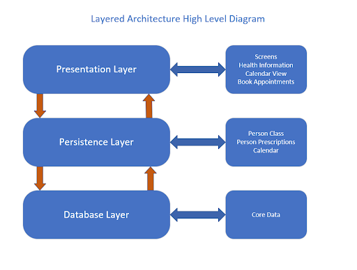

# Health Information Application System Design

## Design Architecture - Layered

### How the Layered Architecture Compliments our Design
The layered architecture fit our system best since we decided to implement the application by sections. Since our application supported multiple user active interfaces, we felt it was best to implement these in parts, and then connect said parts with the rest of the system. Another key to the implementing a layered architecture was our application using constant interfacing with the user, we have to constantly receive input, store that information and output corresponding information. The layered architecture allowed us to seperate our system into three components, or layers, the Presentation Layer, Persistence Layer, and Database Layer.  
 

 
### Layer Functionality
The Presentation Layer is responsible for user interaction, here our system is responsible for creating the screens and multiple events within the application. These can be described as different sections of our application output to the user screen. Interfaces include the Health Information, Calendar, Doctor Information and Appointment Booking.  
 
The Persistence Layer is where all computation happens. Based off the information received through the Presentation Layer, our application creates a Person Class, with prescription and health attributes, and store in the Databse Layer. From this point, we use this class to interact with the rest of the system, such as creating a calendar event to keep track of the prescriptions being taken. 
 
The Database Layer is where we store all our information. Using a common iOS application database, Core Data, we can correctly input and output data to as our system needs. We also contain an external database to allow the user to have a sign-in to the application. 
 

## Class Level Design

### Calendar
The Calendar class includes and portrays information needed to display through the user interface calendar screen. Here, we can pull information from the Person class. It is responsible for handling the prescription including the length and frequency of the medicine, then output it to the calendar.  
 

### Checklist/Prescriptions
The prescription checklist consists of a prescriptionTask class, which contains an array of the prescription Task items that are added to the checklist. Each Task item has a string variable name and boolean variable for the checklist status of the item that can be modified. The prescription list contains a prescription class with the name, dosis, frequency, and purpose of the prescription object. Each prescription object will represent one of the medications of the user and the user will be able to modify its information.  
 

### Doctor Information
There are three parts to be concluded for Doctor’s Informations, which are Doctor specialty, Doctor office address, and Doctor phone number. Under each box, patients can type in the box, and then click save. Then a box jumped out saying success means you have successfully added one doctor’s information. And restated all the information you have just entered. After confirming, click on OK. Click on the left corner to return to the last page, you can see the Doctor’s information you just added is on the homepage of “Doctors”.  
 

### Sign-In Page
The sign in page requires a class that authenticates a user’s credentials using a database provided by Google called Firebase. Each user should have their own calendar, checklist, and doctor information, and a digital medical ID card.  
 

### Medical ID Card
This is a digital medical ID card that has a lot of sensitive information, including your address, date of birth, medical insurance, disabilities, blood type, and if you are a donor.  
 

## Control Issue
So far, we have only encountered one control issue. That was how to store the user log in.  
 

### Firebase 
Using an external Google database, we were able to implement user login and identification.  
 

